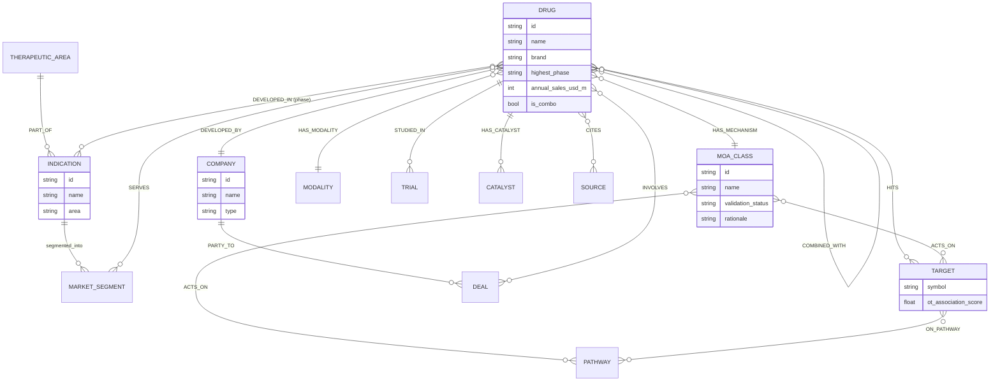

# Atlas data model — the graph behind the map

> Status: design proposal (v2). The current shipping atlas (`atlas.json` v1) is a set of **panels** — great for a scrollable report. To make the atlas *behave* like a living map — click a drug and watch the whole landscape respond — the data wants to be a **graph**: entities are nodes, relationships are edges, and every visual is a *view* computed from that graph. This doc defines that model. The v1 panel model is a **projection** of it, so nothing is lost.

## Why a graph

The interactions you want are all **graph traversals**:

| You click… | You want to see… | In graph terms |
|---|---|---|
| a **drug** | its market, company, MoA, targets, competitors, trials, catalysts | 1-hop neighborhood of a `Drug` node, grouped by edge type |
| a **company** | every MoA it's pursuing in this disease, its whole portfolio, its deals | `Company` → its `Drug`s → their `MoAClass`es (a 2-hop projection) |
| an **MoA class** | its drugs, its targets, the players, its combined market | neighborhood of an `MoAClass` node |
| a **target** | every drug that hits it and the classes acting on it | inverse of `HITS` / `ACTS_ON` |

If the data is a pile of tables, each of those is a bespoke query. If it's a graph, they're **one operation** — "give me the neighborhood of node X, grouped by relation" — and the UI is a single, reusable spotlight. That's the whole design.

## Entities (node types)

Every node shares a base shape: `{ id, type, label, attrs{…}, sources:[srcId] }`.

| Node type | What it is | Key attributes |
|---|---|---|
| **Indication** | a specific disease/indication (the atlas frame) | name, aliases, area, efo/mondo id, prevalence, incidence, segments |
| **TherapeuticArea** | a grouping of indications (the frame for a TA atlas) | name, member indication ids |
| **Drug** | a therapeutic asset — the central actor | name, brand, inn, highest_phase, is_combo, first_approval_year, annual_sales_usd_m |
| **Company** | developer / sponsor / owner | name, type (large pharma \| biotech \| specialty), hq, ticker |
| **MoAClass** | a mechanism-of-action class (groups drugs) | name, validation_status (validated\|emerging\|unproven\|failed), rationale, mechanism |
| **Target** | molecular target (gene/protein) | symbol, name, ot_association_score, tractability |
| **Pathway** | biological pathway / axis | name, role |
| **Modality** | drug type/format | name (mAb, small_molecule, oral_peptide, ASO, cell, gene…) |
| **Trial** | a clinical study / evidence unit | nct_id, phase, status, endpoint, result, start, readout_date |
| **MarketSegment** | patient / line-of-therapy segment | name, share_pct, population, value_usd_m, line |
| **Catalyst** | a forward-looking event | date, kind (readout\|pdufa\|approval\|patent_expiry), significance |
| **Deal** | a transaction | kind (M&A\|licensing\|co-dev), value, year |
| **Source** | provenance / citation | title, url, type, accessed |

`Modality`, `Target`, `Pathway`, `MarketSegment` *could* be plain attributes of a drug — we promote them to **nodes** precisely because you want to click them and pivot ("show everything with this modality / hitting this target / in this segment"). Node-hood = clickability.

## Relationships (edge types)

Edges are directed and typed: `{ id, type, source, target, attrs{…} }`. Some are **stored** (atomic facts); the rest are **derived** (computed by traversal) and never hand-authored — that keeps the data consistent.

### Stored (atomic) edges
| Edge | From → To | Attributes | Meaning |
|---|---|---|---|
| `DEVELOPED_BY` | Drug → Company | role (originator\|partner\|acquirer) | who owns/develops the asset |
| `HAS_MECHANISM` | Drug → MoAClass | — | the drug's mechanism class |
| `HITS` | Drug → Target | action (inhibitor\|agonist\|antagonist) | molecular target(s) |
| `HAS_MODALITY` | Drug → Modality | — | format |
| `DEVELOPED_IN` | Drug → Indication | phase, approved(bool), approval_year | the drug's status **in this indication** (a drug can differ by indication) |
| `STUDIED_IN` | Drug → Trial | — | evidence |
| `COMBINED_WITH` | Drug ↔ Drug | setting | combination regimens |
| `SERVES` | Drug → MarketSegment | line | which segment it addresses |
| `HAS_CATALYST` | Drug → Catalyst | — | upcoming event on the asset |
| `ACTS_ON` | MoAClass → Target / Pathway | — | the biology a class engages |
| `ON_PATHWAY` | Target → Pathway | — | target's pathway |
| `EVALUATES` | Trial → Drug | — | trial's asset |
| `PARTY_TO` | Company → Deal | role (acquirer\|target\|licensor\|licensee) | deal participation |
| `INVOLVES` | Deal → Drug / MoAClass | — | what the deal is about |
| `PART_OF` | Indication → TherapeuticArea | — | TA membership |
| `CITES` | any → Source | — | provenance (every fact-bearing node/edge) |

### Derived (computed) edges — the payoff
| Edge | Derivation | Powers |
|---|---|---|
| `PURSUES` | Company → MoAClass, via `DEVELOPED_BY⁻¹` ∘ `HAS_MECHANISM` | *"click a company → the MoAs it's pursuing here"* |
| `COMPETES_IN` | Company → Indication, via its drugs' `DEVELOPED_IN` | company footprint per disease |
| `COMPETES_WITH` | Drug ↔ Drug, same `MoAClass` **and** shared `Indication` | *"who are this drug's rivals"* |
| `SHARES_MECHANISM` | Indication ↔ Indication, common `MoAClass` | disease-similarity map (**key for TA view**) |
| `CLASS_IN` | MoAClass → Indication, via member drugs | which classes appear in a disease |

Deriving instead of storing these is deliberate: a company "pursuing IL-23" is *true because* it has an IL-23 drug — store the drug fact once, and the company/MoA/competitor views stay automatically correct.

## ER diagram



## The `atlas-graph.json` shape (v2)

```jsonc
{
  "meta": { "scope": "indication" | "therapeutic_area", "focus": "plaque psoriasis", "generated": "…" },
  "nodes": [
    { "id": "drug:risankizumab", "type": "Drug", "label": "risankizumab",
      "attrs": { "brand": "Skyrizi", "highest_phase": "approved", "annual_sales_usd_m": 7763, "modality": "mAb" },
      "sources": ["s_ot", "s_sales"] },
    { "id": "company:abbvie", "type": "Company", "label": "AbbVie", "attrs": { "type": "large pharma" } },
    { "id": "moa:il23", "type": "MoAClass", "label": "IL-23 inhibitors",
      "attrs": { "validation_status": "validated", "rationale": "…" } },
    { "id": "target:IL23A", "type": "Target", "label": "IL23A", "attrs": { "ot_association_score": 0.64 } }
  ],
  "edges": [
    { "type": "DEVELOPED_BY", "source": "drug:risankizumab", "target": "company:abbvie" },
    { "type": "HAS_MECHANISM", "source": "drug:risankizumab", "target": "moa:il23" },
    { "type": "HITS", "source": "drug:risankizumab", "target": "target:IL23A" },
    { "type": "DEVELOPED_IN", "source": "drug:risankizumab", "target": "ind:plaque-psoriasis",
      "attrs": { "phase": "approved", "approved": true, "approval_year": 2019 } }
  ],
  "views": {
    "landscape": { "x": "MoAClass", "y": "phase" },   // hero layout hints
    "lenses": ["moa", "company", "modality", "validation", "phase"]
  },
  "sources": [ /* v1-style source list */ ]
}
```

Node ids are namespaced (`type:slug`) so edges are unambiguous and the UI can style by type. The **panel view** (v1) is just a set of queries over this graph (`top_products` = Drugs with `DEVELOPED_IN.approved` sorted by `annual_sales_usd_m`; `moa_landscape` = MoAClass nodes with their member drugs; etc.), so we render *both* the report and the map from one file. A small compiler upgrades a v1 `atlas.json` into this graph.

## Indication atlas vs. therapeutic-area atlas

Same graph, different **frame** and **hero view** — this is the important structural difference you flagged.

### Indication atlas (e.g. plaque psoriasis)
- Exactly **one `Indication`** in scope; it's the title, not a navigational axis.
- **Hero = the MoA landscape:** columns are `MoAClass`, vertical position is development **phase**, each `Drug` is a card. This is the RA-Capital single-canvas look.
- Spotlight traverses the neighborhood of whatever you click.

### Therapeutic-area atlas (e.g. immuno-dermatology, or IBD, or immuno-oncology)
A TA contains **several `Indication`s** (psoriasis, PsA, HS, axSpA…), and the interesting facts are *cross-indication*. The graph is unchanged; three things become first-class:

1. **Indication becomes an axis, not just a frame.** The hero is a **cross-indication matrix** — rows = indications, columns = MoA classes (or companies) — each cell showing asset count / lead asset / most-advanced phase. It answers "which mechanisms are being worked across this whole area, and where are the gaps."
2. **Shared structure lights up.** A `Drug` `DEVELOPED_IN` several indications, an `MoAClass` spanning indications (IL-17 across pso / PsA / axSpA / HS), and a `Company` with a portfolio across the area become the connective tissue. The derived `SHARES_MECHANISM` edge draws a **disease-similarity map** — which indications are mechanistically adjacent (and therefore label-expansion / portfolio targets).
3. **Drill-down navigation.** TA overview → click an `Indication` → its full indication atlas (the psoriasis view) → click an entity → spotlight. A breadcrumb walks back up. Clicking a `Drug`/`Company`/`MoAClass` at the TA level highlights it **across every indication** it touches.

So: an **indication atlas is depth in one column of biology**; a **TA atlas is breadth across indications with the same drugs/companies/mechanisms as the warp threads.** One data model serves both; the renderer picks the hero view from `meta.scope`.

## How this maps to the pipeline

The fetchers already produce most of the atoms:
- `Drug`, `HAS_MECHANISM`, `HITS`, `ACTS_ON`, `Target` ← **Open Targets** (`drugAndClinicalCandidates`, `associatedTargets`).
- `Drug`, `STUDIED_IN`, `Trial`, `DEVELOPED_IN.phase`, `DEVELOPED_BY` (with curation) ← **ClinicalTrials.gov**.
- approvals, `Modality`, boxed warnings ← **openFDA**.
- `annual_sales_usd_m`, `MarketSegment` sizes, `Deal`, `Catalyst` ← **web search** (cited).

The synthesis step's job is to resolve these into clean, de-duplicated nodes and the stored edges; the derived edges and every view come for free.
